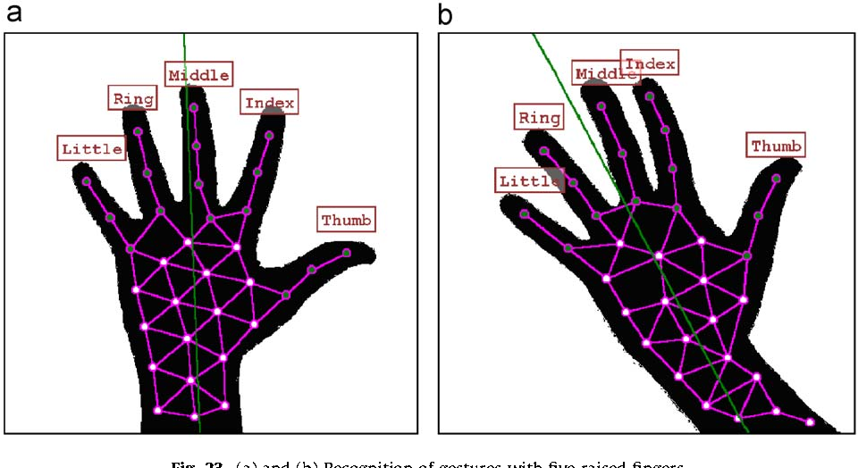

# Hand Gesture Recognition & Control

## Overview

Hand Gesture Recognition & Control is a deep learning-based system that enables real-time recognition and interpretation of hand gestures for applications such as gesture-controlled drones, AI-based interaction, and more. This project integrates various machine learning techniques, including CNNs, MediaPipe, YOLO, and LSTMs, to achieve robust gesture recognition and control.

## Features

- **Real-Time Hand Gesture Recognition** using CNNs and MediaPipe
- **Gesture-Controlled Drone Simulation** in V-REP
- **Dataset Collection and Training Pipeline** for customized gestures
- **Integration with Edge Devices** for efficient deployment
- **Multi-modal AI Fusion** with future voice integration

---

## Installation

### Prerequisites

Ensure that you have the following dependencies installed:

```bash
pip install -r requirements.txt
```

You may also need to install additional dependencies based on the modules you use.

### Clone the Repository

```bash
git clone https://github.com/your-repo/Hand-Gesture-Recognition-Control.git
cd Hand-Gesture-Recognition-Control
```

---

## Dataset

The dataset used for training consists of multiple hand gesture images labeled for different actions. Below are some of the sample gestures used in training:

### Hand Gesture Dataset Samples


### Gesture Classes


---

## Model Architecture

The architecture is built using a combination of:
- Convolutional Neural Networks (CNNs) for feature extraction
- LSTMs for sequence-based hand movement recognition
- MediaPipe framework for robust hand tracking
- ONNX models for optimized inference

### Hand Landmarks Detection


---

## Training Process

The training process involves data augmentation, model optimization, and validation:

```bash
python keypoint_classification.ipynb
python point_history_classification.ipynb
```

### Training Pipeline Visualization


---

## Inference and Real-Time Gesture Recognition

To run the inference:

```bash
python app.py
```

This will start real-time gesture recognition using the webcam.

### Example of Real-Time Hand Gesture Detection


### Hand Gesture Recognition in Action


---

## Gesture-Controlled Drone Simulation

This project also includes a simulated drone that can be controlled using recognized hand gestures. The simulation is implemented in V-REP.

### Simulation Video


### Drone Simulation Framework



---

## Real-Time Hand Pose Tracking

A continuous hand tracking system allows gesture-based AI interaction.


### Pose Tracking GIF


---

## Edge Deployment

This system supports deployment on edge devices such as Raspberry Pi or other embedded systems for real-time low-power inference.

### Edge Deployment Image


---

## Future Improvements

- **Multi-Modal Fusion**: Integration with voice commands for enhanced control
- **Optimized Deployment**: Using TensorRT for efficient inference
- **Gesture Customization**: Allowing users to add custom gestures for personalized interaction

---

## Conclusion

This project serves as a robust foundation for real-time hand gesture recognition and AI-controlled applications. With future improvements, this system can be used in various domains, including AR/VR, robotics, and smart environments.

For any questions or contributions, feel free to open an issue or a pull request!

